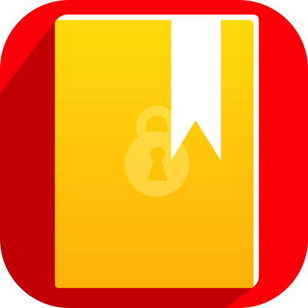

  <h1>Personal Diary</h1>
  
   
  
  

    <strong>Simple and Easy To Use</strong> Journalling App
  

  

    Available on iOS, iPadOS, macOS(beta) and watchOS
  

---

This repository is for issue tracking purposes, and for hosting of macOS stable and beta releases. It does not contain the source code for Personal Diary.

**Contents**

- [Official Webpage](https://www.wernjie.com/personal-diary/)
- [Description](#description)
- [Downloads](#downloads)
    + [Stable Release](#stable-release)
    + [Beta Release](#beta-release)
- [Changelog](CHANGELOG.md)
- [Contributing](#contributing)

## Description

Personal Diary is a simple and easy to use journalling app which is completely free with no advertisements and limitations. Easily access all your entries in all your devices with iCloud Sync. With passcode & biometric protection, you can write diary entries without worrying that someone will peek at what you wrote. Forgot about your diary? The app will now 'summon' you back a friendly nudge. You can also import as many photos as you wish into your entries. As an addition, you can optionally set your mood and the current weather.

Notable Features:
- Available on all primary Apple OSes.\*
- iCloud Sync across all your devices.
- Numeric passcode lock (any number of digits).
- Unlock using Touch ID or Face ID.
- Simple & Easy to use.
- Auto-saves as you type.
- Ability to pick a mood.
- Ability to choose the weather of the day.
- Mood & Weather can be automatically chosen.
- Import photos to your entries.
- Notifications to remind you to write in your diary daily.
- Smart Search - look for stuff with intelligent search.
- Select a theme of your liking.
- Dark Mode for better night use.
- Fully supports iPad Multitasking Features.
- Fully supports external keyboard and trackpad.
- Fully supports VoiceOver.
- Simple Rich Text editing supported.
- Siri Shortcuts and Integration (experimental).
- Full-fledged Apple Watch app, with ability to browse a mini-Timeline, and add or edit entries.
- FlickType keyboard integration in the Apple Watch app, allowing for a faster and more convenient typing experience on your wrist.
- NO Ads & absolutely FREE! :D

\* All Apple OSes supported include: iOS, iPadOS, macOS and watchOS. The macOS version of the app is in beta. It does not make sense to have a tvOS version of Personal Diary.

## Downloads
### Stable Release

Recommended:
- **App Store (iOS, iPadOS, watchOS)**
    + https://apps.apple.com/app/personal-diary-journal-app/id1052570257

Alternatives:
- **Homebrew (macOS):**
    + [No releases yet]
- **Manual Download (macOS):**
    + [No releases yet]

### Beta Release

Beta releases are inherently unstable. Please backup your data before trying them out.

Recommended:
- **TestFlight (iOS, iPadOS, watchOS):**
    + https://testflight.apple.com/join/vGSyL9K7
- **Homebrew (macOS):**
    + `brew cask install wernjie/formulae/personal-diary-beta`

Alternatives:
- **Manual Download (macOS):**
    + https://github.com/wernjie/personal-diary/releases
    + Downloading from here is not recommended as autoupdate functionality is not present within the app.

## Changelog

See [CHANGELOG.md](CHANGELOG.md).

## Contributing
- You should only report issues regarding the functionality and usability of the app (i.e. bugs, feature requests etc).
    + Do *not* request for help on forgotten passcodes on Github.
- Title and describe your issue adequately, with relevant information about your device and any steps to reproduce (if applicable).
- Please avoid submitting duplicate issues. If you find a documented issue, you may add information as a comment if necessary.

---

Copyright © Wern Jie Lim 2015-2020.
